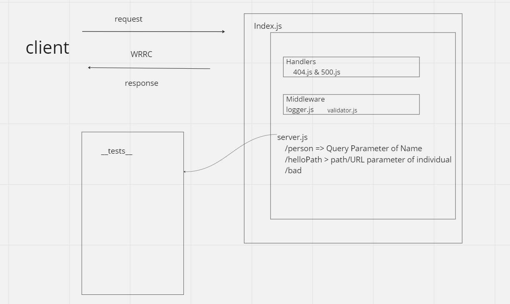

# LAB - Class 02

## Project: Basic Express Server

### Author: Jacob Dang

### Problem Domain
Building a building Express server with the best and most efficient practices. Must include modularization, use of middleware as well as tests.

### Links & Resources
{GitHub Actions} {URL}
{Deployed Web Service} {https://lab2-basic-express-server.onrender.com}

see '.env.sample'

### Features/Routes:
- Feature One:
    - GET method using Path: /person
- Feature Two:
    - Errors Handlers (404, 500) and Query String must relay a message if error or Query occurs respectively

- Feature Three:
    - validator.js & validator.test.js are used to confirm and/or send error message in context to query strings

#### Tests
- How do you run tests?
    - npm start
- Any tests of note:
    - handles root path
    - handles invalid requests
    - handles errors`

## UML
